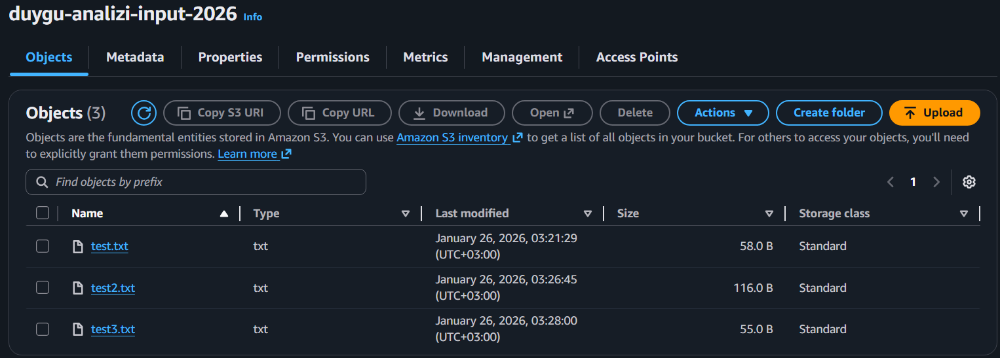
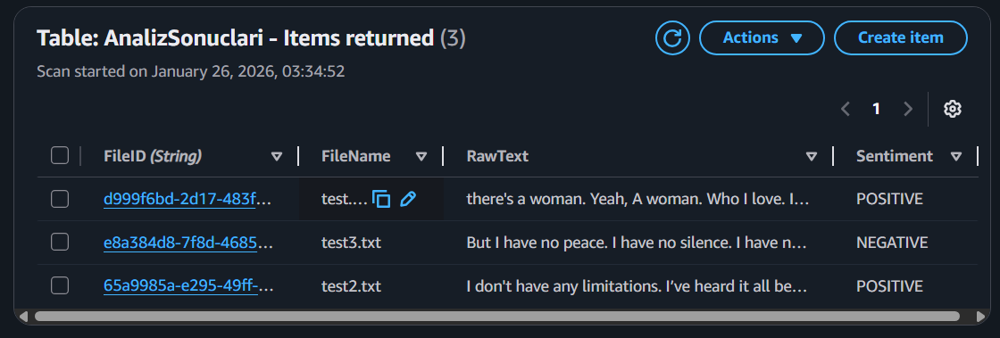
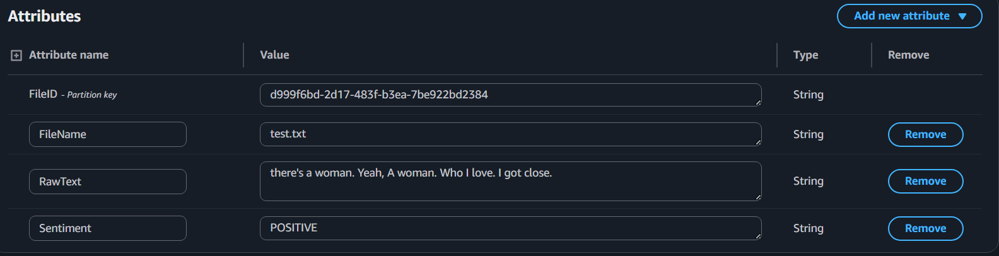
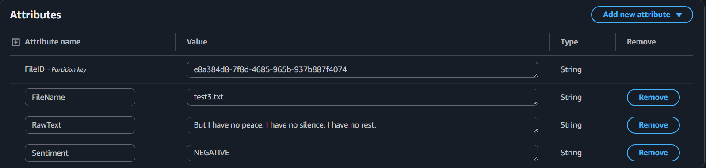
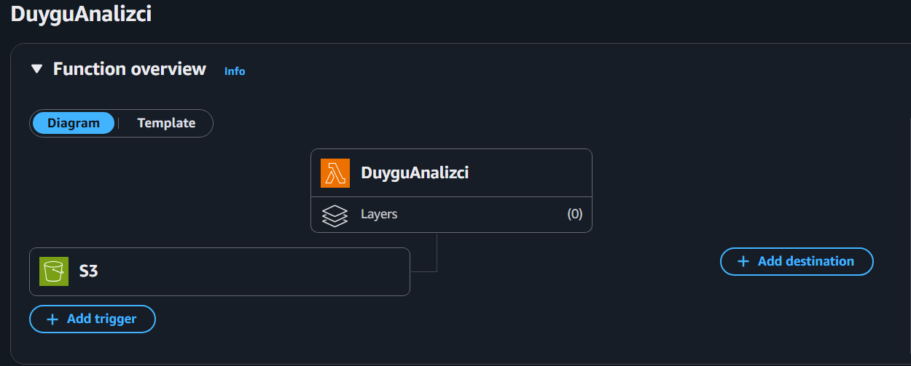
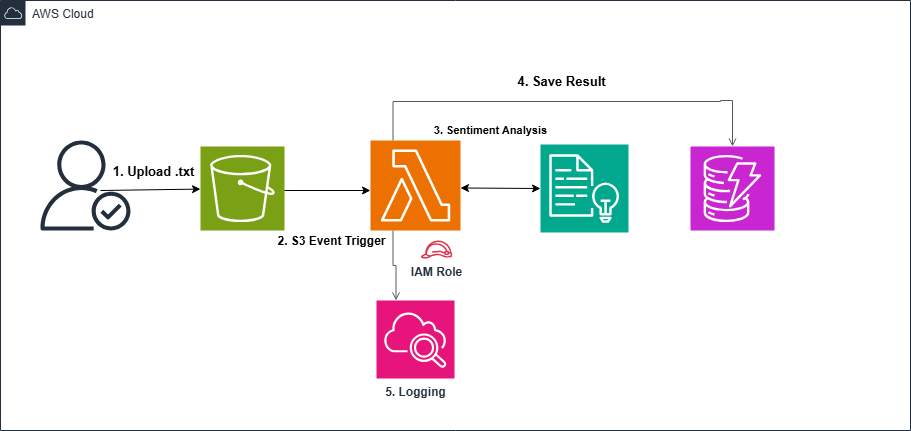

# AWS-Serverless-Sentiment-Analysis-Pipeline
Bu proje, AWS üzerinde Olay Güdümlü Mimari (Event-Driven Architecture) prensipleri kullanılarak geliştirilmiş bir metin analiz sistemidir. Kullanıcı tarafından S3'e yüklenen herhangi bir metin dosyası, otomatik olarak işlenir ve duygu analizi (Sentiment Analysis) yapılarak sonuçlar veritabanına kaydedilir.

# Kullanılan AWS Servisler

**S3:** Veri depolama ve tetikleyici.

**Lambda:** İşlemci (Kodu çalıştıran yer).

**Comprehend:** Metni analiz eden yapay zeka.

**DynamoDB:** Sonuçların yazıldığı veritabanı.

# Mimari Özellikler
Sistem, AWS'nin İyi Yapılandırılmış Çerçeve (Well-Architected Framework) prensiplerine göre tasarlanmıştır:

**Decoupling (Sistem Ayrıştırma):** S3 ve Lambda arasındaki asenkron ilişki, sistemin bileşenlerini birbirinden bağımsız hale getirir.

**Security (Güvenlik):** Lambda fonksiyonu, Least Privilege (En Az Yetki) prensibiyle sadece ihtiyaç duyduğu S3, Comprehend ve DynamoDB kaynaklarına erişebilen özel bir IAM rolü ile çalışır.

**High Availability (Yüksek Erişilebilirlik):** Projede kullanılan tüm servisler (S3, Lambda, DynamoDB) AWS tarafından yönetilen ve "Multi-AZ" (Çoklu Erişilebilirlik Alanı) mimarisine sahip servislerdir.

